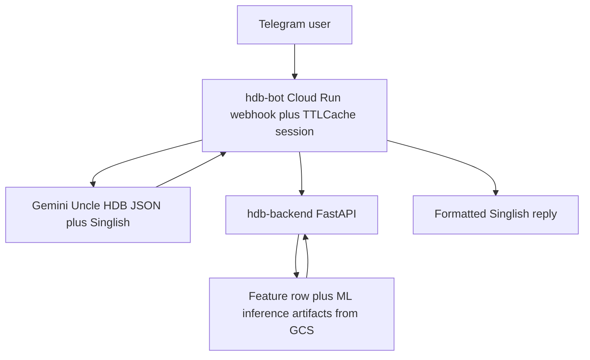
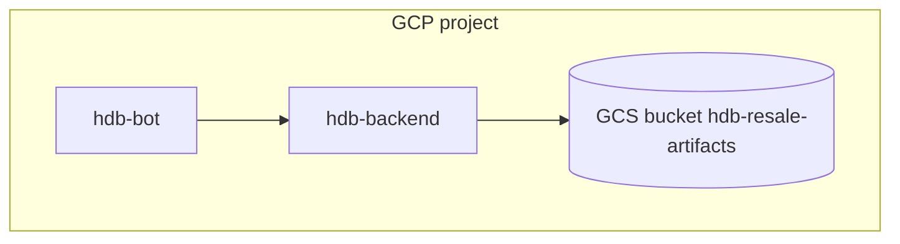
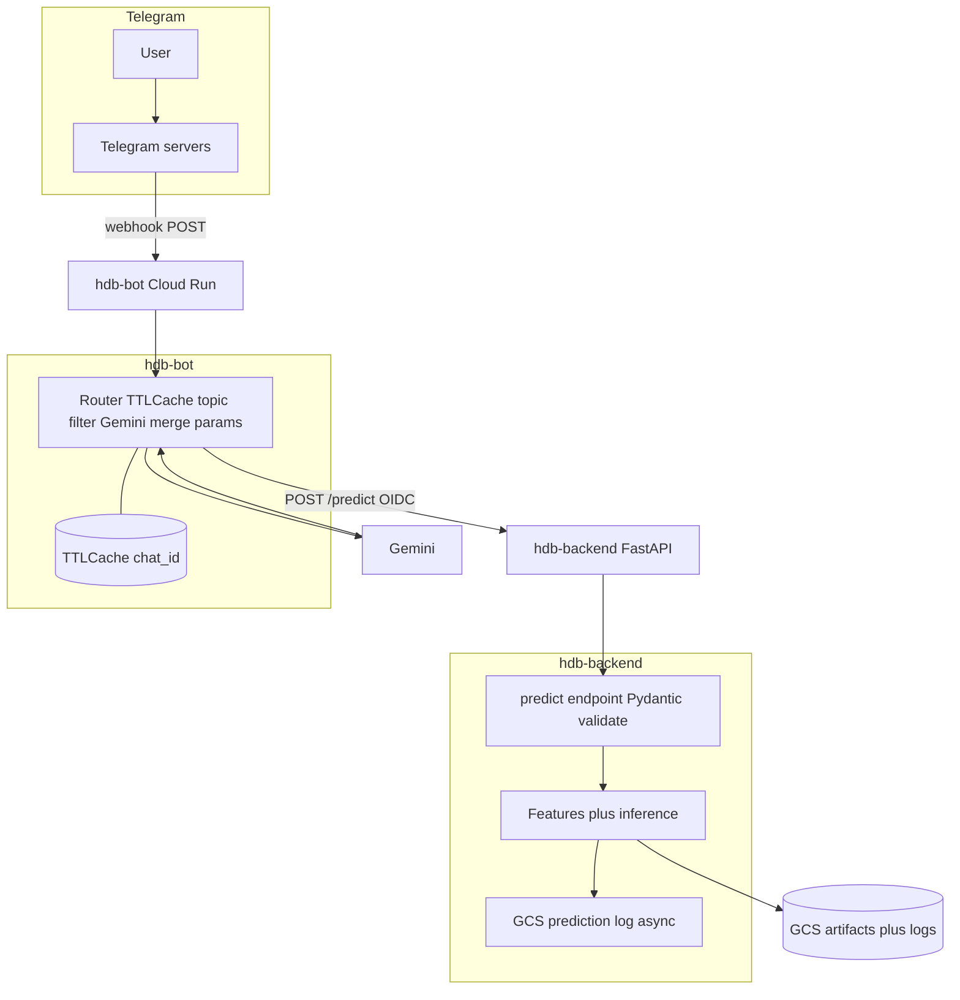
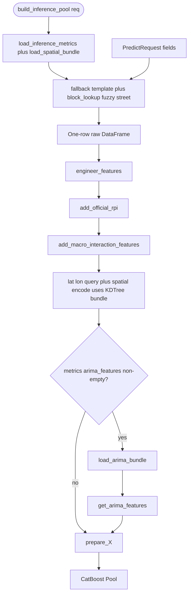
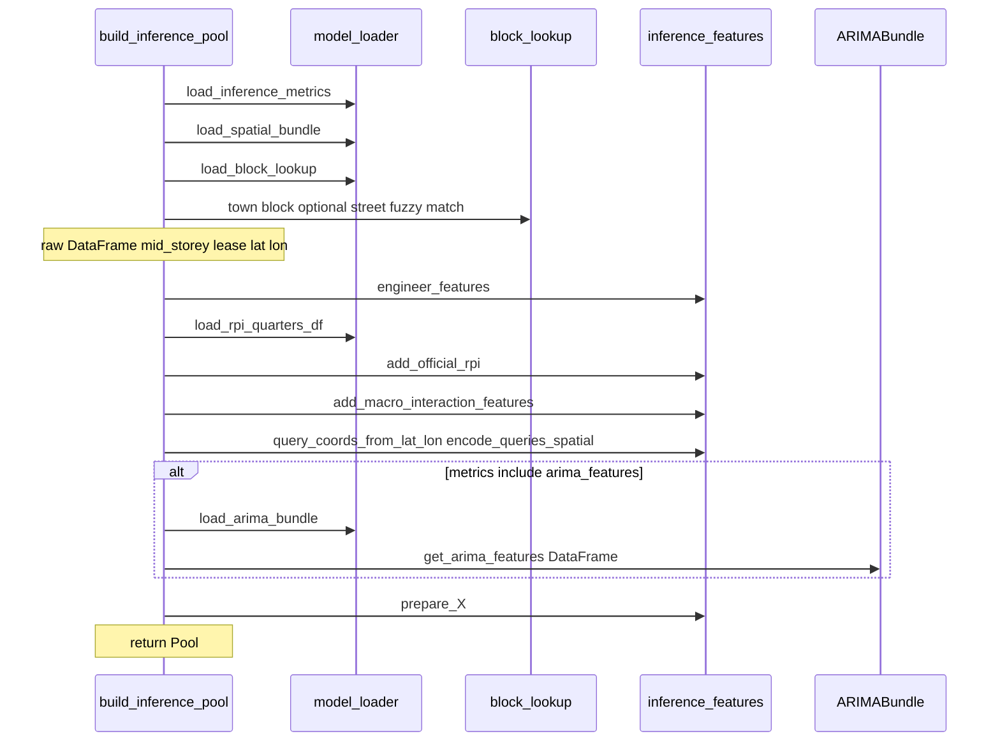

# Technical Implementation Guidelines

# HDB SG Resale Price Estimation — Telegram Bot (v3.0 — GCP Native)

> **Version:** 3.0  
> **Date:** April 2026  
> **Scope:** End-to-end design for a Telegram chatbot with Gemini-powered natural Singlish conversation, topic guardrails, ML-powered price estimation — fully deployed on **Google Cloud Run** with **Google Cloud Storage** for artifact persistence and **Python in-process cache** for session state.
>
> **What changed from v2.0**:
>
> - 🔄 **LLM**: Anthropic Claude → **Google Gemini** (`gemini-2.0-flash`)
> - 🔄 **Session cache**: Redis → **Python in-process TTL cache** (`cachetools`)
> - 🔄 **Storage**: PostgreSQL + Docker volumes → **Google Cloud Storage (GCS)** bucket
> - 🔄 **Deployment**: Docker Compose / VPS → **Google Cloud Run** (fully managed, serverless)
> - ❌ **Removed**: Redis, PostgreSQL, Kubernetes, Docker Compose

---

## Table of Contents

1. [System Overview](#1-system-overview)
2. [Architecture Design](#2-architecture-design)
3. [LLM Conversation](#3-llm-conversation)
4. [Telegram Bot — Integration Layer](#4-telegram-bot--integration-layer)
5. [Backend API Service](#5-backend-api-service)
6. [Python In-Process Session Cache](#6-python-in-process-session-cache)
7. [ML Pipeline — Data, Model & Training](#7-ml-pipeline--data-model--training)
8. [Google Cloud Storage — Artifact & Log Management](#8-google-cloud-storage--artifact--log-management)
9. [Google Cloud Run — Deployment](#9-google-cloud-run--deployment)
10. [API Contract](#10-api-contract)
11. [Environment & Configuration](#11-environment--configuration)
12. [Tech Stack Summary](#12-tech-stack-summary)
13. [Project Structure](#13-project-structure)
14. [Development Roadmap](#14-development-roadmap)

---

## 1. System Overview

### 1.1 Architecture Overview



ASCII fallback (same flow): User → **hdb-bot** → **Gemini** → **hdb-backend** → ML/GCS → reply.

### 1.2 Deployment Topology

All three services are deployed as **independent Cloud Run services**:



Legacy layout reference: **models/** (`model.pkl` / `.cbm` depending on version), **logs/predictions/**, optional **training/** CSV — see §8 for current artifact names.

### 1.3 Design Principles (v3.0)

- **Serverless-first**: Cloud Run scales to zero; no idle compute cost.
- **Stateless services**: All session state is held in Python in-process TTL cache. Cloud Run instances are sticky per chat via Telegram webhook routing (single instance per bot service recommended for MVP; see Section 7.4 for scaling notes).
- **No database**: Prediction logs are streamed as JSONL files to GCS bucket.
- **No Redis**: `cachetools.TTLCache` handles conversation sessions in memory.
- **Single artifact store**: GCS bucket is the single source of truth for model files and logs.

---

## 2. Architecture Design

### 2.1 Detailed Component Diagram



### 2.2 Communication Flow

```
1.  Telegram sends webhook POST → hdb-bot Cloud Run
2.  Bot looks up session from TTLCache (chat_id key)
3.  Quick keyword pre-filter: off-topic? → LLM handles redirect
4.  Bot calls Gemini with: system_prompt + conversation history + user message
5.  Gemini returns JSON: { reply, extracted_params, ready_to_predict, off_topic }
6.  Bot merges extracted_params into TTLCache session (nulls don't overwrite)
7.  Bot appends turn to conversation history in TTLCache
8.  Bot sends Gemini reply text to Telegram user
9.  If ready_to_predict=true:
      a. Bot calls POST https://hdb-backend.run.app/predict
      b. Backend runs inference, streams log to GCS
      c. Bot calls Gemini again to format result in Singlish
      d. Bot sends formatted result to user, clears session from cache
```

---
## 3. LLM Conversation

### 3.1 LLM Choice


| Attribute         | Choice                                           |
| ----------------- | ------------------------------------------------ |
| Provider          | Google AI                                        |
| Model             | `gemini-2.0-flash`                               |
| SDK               | `google-genai` (Python)                          |
| Mode              | Multi-turn chat with injected system instruction |
| Output format     | Structured JSON + natural Singlish reply         |
| Max output tokens | 1024 per turn                                    |
| Temperature       | 0.4                                              |


> **Why Gemini 2.0 Flash?** Fast, cost-effective, strong instruction following, excellent JSON output reliability, and native Google Cloud integration (Vertex AI option available for enterprise). Flash tier keeps per-session LLM cost under $0.001.

### 3.2 Gemini SDK Setup

```python
# bot/llm/gemini_client.py
import os
import google.generativeai as genai

genai.configure(api_key=os.environ["GEMINI_API_KEY"])

def get_gemini_model() -> genai.GenerativeModel:
    """Create Gemini model with safety settings tuned for HDB chat."""
    return genai.GenerativeModel(
        model_name="gemini-2.0-flash",
        generation_config=genai.GenerationConfig(
            temperature=0.4,
            max_output_tokens=1024,
            response_mime_type="application/json",  # Force JSON output mode
        ),
        safety_settings=[
            {"category": "HARM_CATEGORY_HARASSMENT",        "threshold": "BLOCK_NONE"},
            {"category": "HARM_CATEGORY_HATE_SPEECH",       "threshold": "BLOCK_NONE"},
            {"category": "HARM_CATEGORY_SEXUALLY_EXPLICIT", "threshold": "BLOCK_MEDIUM_AND_ABOVE"},
            {"category": "HARM_CATEGORY_DANGEROUS_CONTENT", "threshold": "BLOCK_MEDIUM_AND_ABOVE"},
        ]
    )
```

### 3.3 System Prompt Design

```python
# bot/llm/system_prompt.py
from bot.constants import VALID_TOWNS, VALID_FLAT_TYPES, VALID_FLAT_MODELS

def build_system_prompt(collected_params: dict) -> str:
    missing = [k for k, v in collected_params.items() if v is None]
    collected_display = "\n".join(
        f"  - {k}: {v}" for k, v in collected_params.items() if v is not None
    ) or "  (nothing collected yet)"

    return f"""
You are Uncle HDB — a friendly, warm Singaporean housing kakak/uncle chatbot on Telegram.
Your ONLY job is to help people estimate HDB resale flat prices in Singapore.
You speak natural Singlish: casual, warm, local — like a helpful kampung neighbour, not a government officer.

━━━━━━━━━━━━━━━━━━━━━━━━━━━━━━━━━━
🎭 PERSONA & TONE RULES
━━━━━━━━━━━━━━━━━━━━━━━━━━━━━━━━━━
- Speak natural Singlish. Sprinkle (don't spam): lah, lor, leh, ah, wah, aiyo, aiyah,
  sia, can, liddat, steady, walao, shiok, blur, confirm plus chop, one (at end of sentence).
- Short punchy sentences. 2–3 lines per paragraph. Use newlines liberally.
- Acknowledge what user said BEFORE asking next question.
- Warm reactions to context: "Wah Bishan ah! Quite atas area leh!"
- If user corrects themselves: "Ohhh ok ok, I update for you! 👍"
- Never say "I am an AI" or "as a language model". You are Uncle HDB.
- Max 2 emojis per message. 1 emoji on follow-up turns.
- Never robotic. Not "Input received: TAMPINES". Instead: "Ah Tampines, noted!"

━━━━━━━━━━━━━━━━━━━━━━━━━━━━━━━━━━
🚫 TOPIC GUARDRAIL — STRICT
━━━━━━━━━━━━━━━━━━━━━━━━━━━━━━━━━━
You ONLY discuss HDB resale flat prices in Singapore. Nothing else.
Topics: HDB flat valuation, resale price estimation, town comparison, flat types, storey, lease, floor area.

If user asks ANYTHING off-topic (food, weather, politics, coding, BTO, condo, private property, crypto, etc.),
redirect warmly but firmly. NEVER answer off-topic content, even partially.

Redirect examples:
- "Alamak, that one outside my lane leh 😄 I only know HDB resale prices one. Which flat you want to check ah?"
- "Aiyoh food question I blur lah! I'm only expert in HDB lor. So back to your flat — which town?"
- "Wah condo ah? That one different story leh. I only do HDB resale. Got HDB flat to check anot?"

━━━━━━━━━━━━━━━━━━━━━━━━━━━━━━━━━━
📋 8 PARAMETERS TO COLLECT
━━━━━━━━━━━━━━━━━━━━━━━━━━━━━━━━━━
You need ALL 8 before estimating:

1. town               Valid: {', '.join(VALID_TOWNS)}
2. flat_type          Valid: {', '.join(VALID_FLAT_TYPES)}
3. flat_model         Valid: {', '.join(VALID_FLAT_MODELS)}
4. storey_range       Format "NN TO NN". Infer from natural language:
                      "around 8th floor" → "07 TO 09", "high floor ~20" → "19 TO 21"
5. floor_area_sqm     Float, 20–300. Parse "~93sqm", "about 90 square meters" → float
6. remaining_lease_years  Float (decimal years). Parse:
                      "61 years 4 months" → 61.33, "about 60 years" → 60.0, "60 over years" → 60.5
7. street_name        Free text. e.g. "TAMPINES ST 42"
8. block              Alphanumeric. e.g. "456B"

━━━━━━━━━━━━━━━━━━━━━━━━━━━━━━━━━━
📦 COLLECTED SO FAR
━━━━━━━━━━━━━━━━━━━━━━━━━━━━━━━━━━
{collected_display}

Still missing: {', '.join(missing) if missing else '✅ ALL COLLECTED — ready to predict!'}

━━━━━━━━━━━━━━━━━━━━━━━━━━━━━━━━━━
🧠 EXTRACTION RULES
━━━━━━━━━━━━━━━━━━━━━━━━━━━━━━━━━━
- Extract ALL params mentioned in ONE message — user may give several facts at once.
- Validate against valid lists. If ambiguous (e.g. "bukit" → multiple towns), ask to clarify.
- flat_type: "4-room","4room","four room","4RM" → "4 ROOM"
- town: "tampines","TPE area","near tampines MRT" → "TAMPINES"
- street_name given → try to infer town if not stated.
- NEVER assume or guess values you are not confident about. Ask instead.
- If user corrects a param, update it; don't re-ask already-confirmed values.
- Ask ONLY for missing params. Group multiple missing fields into one natural question.

━━━━━━━━━━━━━━━━━━━━━━━━━━━━━━━━━━
📤 OUTPUT FORMAT — MANDATORY
━━━━━━━━━━━━━━━━━━━━━━━━━━━━━━━━━━
ALWAYS respond with ONLY this JSON. No text outside it.

{{
  "reply": "<Singlish reply to send to user>",
  "extracted_params": {{
    "town": "<value or null>",
    "flat_type": "<value or null>",
    "flat_model": "<value or null>",
    "storey_range": "<value or null>",
    "floor_area_sqm": <number or null>,
    "remaining_lease_years": <number or null>,
    "street_name": "<value or null>",
    "block": "<value or null>"
  }},
  "ready_to_predict": <true or false>,
  "off_topic": <true or false>
}}

Rules:
- extracted_params: ONLY values extracted from THIS turn. null = not mentioned this turn.
- ready_to_predict: true ONLY when ALL 8 params are confirmed across all turns.
- off_topic: true when message is unrelated to HDB resale prices.
- reply: warm, natural Singlish. What the user sees.
- No markdown fences, no extra keys, no text outside the JSON.
"""
```

### 3.4 LLM Engine — Core Logic

```python
# bot/llm/engine.py
import json, re, logging
import google.generativeai as genai
from bot.llm.gemini_client import get_gemini_model
from bot.llm.system_prompt import build_system_prompt

logger = logging.getLogger(__name__)


async def process_message(
    user_message: str,
    conversation_history: list[dict],
    collected_params: dict,
) -> dict:
    """
    Send user message to Gemini with full context.
    Returns parsed dict: { reply, extracted_params, ready_to_predict, off_topic }
    """
    model = get_gemini_model()
    system_instruction = build_system_prompt(collected_params)

    # Build Gemini contents: alternate user/model turns
    contents = []
    for turn in conversation_history[-20:]:  # last 20 turns
        role = "user" if turn["role"] == "user" else "model"
        contents.append({"role": role, "parts": [{"text": turn["content"]}]})
    contents.append({"role": "user", "parts": [{"text": user_message}]})

    try:
        response = model.generate_content(
            contents=contents,
            generation_config=genai.GenerationConfig(
                temperature=0.4,
                max_output_tokens=1024,
                response_mime_type="application/json",
                system_instruction=system_instruction,
            ),
        )
        raw = response.text.strip()
        return _parse_response(raw)

    except Exception as e:
        logger.error(f"Gemini API error: {e}")
        return {
            "reply": "Aiyoh, something snagged on my end leh 😅 Can try again in a bit?",
            "extracted_params": {},
            "ready_to_predict": False,
            "off_topic": False,
        }


def _parse_response(raw: str) -> dict:
    """Parse JSON from Gemini response with fallback."""
    clean = re.sub(r"```(?:json)?", "", raw).strip().rstrip("`").strip()
    try:
        data = json.loads(clean)
        data.setdefault("reply", "Hmm, say that again ah? I blur a bit 😅")
        data.setdefault("extracted_params", {})
        data.setdefault("ready_to_predict", False)
        data.setdefault("off_topic", False)
        return data
    except json.JSONDecodeError as exc:
        logger.warning(f"JSON parse failed: {exc} | raw={raw[:200]}")
        return {
            "reply": "Eh sorry, I got confused just now 😅 Can repeat what you said?",
            "extracted_params": {},
            "ready_to_predict": False,
            "off_topic": False,
        }


async def format_result_singlish(prediction: dict, params: dict) -> str:
    """Use Gemini to craft a warm Singlish result message."""
    model = get_gemini_model()
    prompt = f"""
You are Uncle HDB. A user just got their HDB resale price estimate.
Write a warm, natural Singlish reply (5–8 lines) that:
- Recaps the key flat details (town, flat type, storey, floor area)
- Highlights the predicted price in bold Markdown (*SGD X*)
- Mentions the low–high range casually
- Ends with a friendly closing line

Flat details: {json.dumps(params, indent=2)}
Prediction: {json.dumps(prediction, indent=2)}

Return ONLY the plain Singlish text (Markdown ok). No JSON. No preamble.
"""
    resp = model.generate_content(prompt)
    return resp.text.strip()
```

### 3.5 Conversation Examples

#### Multi-param extraction in one message

```
User:   "I want check price for 4-room flat at Tampines St 42, block 456B,
         around 8th floor, got about 61 years lease left"

Gemini extracts:
  flat_type=4 ROOM, street_name=TAMPINES ST 42, block=456B,
  storey_range=07 TO 09, remaining_lease_years=61.0
  (town inferred from street → TAMPINES)

Reply:  "Wah, you gave me a lot of info in one shot — steady lah! 👍
         Got Tampines, 4-room, Block 456B at Tampines St 42,
         around 7th–9th floor, 61 years lease. Noted!

         Two more things I need —
         what's the flat model (like Model A, Standard, DBSS etc.)?
         And the floor area in sqm?"
```

#### User correction mid-conversation

```
User:   "Actually wait, it's 5-room lah, I made mistake"

Gemini extracts: flat_type=5 ROOM (overwrites previous 4 ROOM)

Reply:  "Ohhh ok ok, 5-room noted, I update already! 😄
         So which flat model ah?"
```

#### Off-topic redirect

```
User:   "Eh what's good to eat in Tampines?"

Gemini: off_topic=true

Reply:  "Hahaha wah food question ah! Aiyoh I only expert in
         HDB prices lah, not food critic one 😄
         So back to your flat — which flat model is it?"
```

#### Ambiguous categorical

```
User:   "My flat model is the normal one"

Reply:  "Hmm 'normal one' got a few possibilities leh 😅
         Is it Standard, Model A, or Improved?
         These three are the most common 'normal' ones."
```


---

### 3.6 Singlish Vocabulary Reference


| Expression          | Meaning / Use Case                                               |
| ------------------- | ---------------------------------------------------------------- |
| `lah`               | Softener / affirmation — "Ok lah", "Can lah"                     |
| `lor`               | Resigned / explanatory — "Like that lor", "Just check lor"       |
| `leh`               | Mild surprise / emphasis — "Expensive leh!", "I dunno leh"       |
| `ah`                | Seeking confirmation / softener — "Which town ah?", "5-room ah?" |
| `sia`               | Exclamation of surprise — "700k sia!"                            |
| `wah`               | Exclamation — "Wah, nice area!"                                  |
| `aiyo` / `aiyah`    | Mild facepalm — "Aiyo, wrong floor lah"                          |
| `can`               | Affirmative — "Can, no problem"                                  |
| `liddat`            | "Like that" — "If liddat, different price"                       |
| `steady`            | Cool / solid — "Steady, good choice"                             |
| `confirm plus chop` | Absolutely certain — "Confirm plus chop worth it"                |
| `walao`             | Strong surprise — "Walao, that quite high leh!"                  |
| `shiok`             | Something great — "Shiok, good price!"                           |
| `blur`              | Confused — "Sorry, I blur a bit"                                 |
| `one`               | Emphasis (end of sentence) — "Confirm expensive one"             |
| `never mind lah`    | Reassurance — "Never mind lah, I help you"                       |
| `kakak` / `uncle`   | Friendly self-reference                                          |


### 3.7 Tone Rules

- **Short paragraphs**: 2–3 sentences, then newline.
- **Acknowledge first**: Comment on what user said before asking next question.
- **Warm, never sarcastic**: Even when redirecting off-topic messages.
- **No robotic phrasing**: Never "Parameter stored", "Value received", etc.
- **Emoji discipline**: 1 max on follow-up turns, 2 max on greetings/results.
- **Never repeat** the same particle (`lah`) in consecutive sentences.

### 3.8 Welcome Message Template

```
/start or /estimate:

"Eh hello! 👋 I'm Uncle HDB — your kakak for checking HDB resale prices in SG!

Just tell me about the flat lor. Can be one shot or slowly slowly, up to you.
Like: 'Looking at a 4-room in Tampines, around 8th floor' — liddat also can.

So, which flat you want to check ah? 🏠"
```

---

### 3.9 Two-Layer Guardrail


| Layer       | Mechanism                                    | Purpose                                                      |
| ----------- | -------------------------------------------- | ------------------------------------------------------------ |
| **Layer 1** | Keyword pre-filter (`guards/topic_check.py`) | Fast O(1) check before LLM call — saves cost on obvious spam |
| **Layer 2** | Gemini system prompt instructions            | Nuanced handling of ambiguous / partially on-topic messages  |


### 3.10 Keyword Pre-Filter

```python
# bot/guards/topic_check.py

_OFF_TOPIC = {
    # food & lifestyle
    "recipe","chicken rice","bubble tea","hawker","makan","restaurant",
    # tech / coding
    "python","javascript","html","coding","code","chatgpt","openai",
    # finance (non-property)
    "crypto","bitcoin","stock market","shares","forex","etf",
    # politics
    "pap","election","parliament","minister","opposition",
    # other property types
    "condo","condominium","bto","ec property","private property","landed",
    "penthouse","villa","serviced apartment",
    # misc
    "weather","football","soccer","movie","song","recipe",
    "relationship","girlfriend","boyfriend",
}

_HDB_KEYWORDS = {
    "hdb","flat","resale","room","storey","floor","sqm","lease",
    "block","street","town","price","estimate","ang mo kio","bedok",
    "bishan","bukit","central","choa chu kang","clementi","geylang",
    "hougang","jurong","kallang","marine parade","pasir ris","punggol",
    "queenstown","sembawang","sengkang","serangoon","tampines",
    "toa payoh","woodlands","yishun","whampoa",
    "model a","dbss","maisonette","executive","standard","improved",
}

def quick_topic_check(message: str) -> str:
    """
    Returns: 'hdb' | 'off_topic' | 'ambiguous'
    'ambiguous' means pass to LLM for nuanced decision.
    """
    lower = message.lower()
    tokens = set(lower.split())

    has_hdb = bool(_HDB_KEYWORDS & tokens) or any(kw in lower for kw in _HDB_KEYWORDS)
    has_off = bool(_OFF_TOPIC & tokens)   or any(kw in lower for kw in _OFF_TOPIC)

    if has_hdb and not has_off:
        return "hdb"
    if has_off and not has_hdb:
        return "off_topic"
    return "ambiguous"
```

### 3.11 Allowed vs. Redirected Topics


| Topic                                | Handling                                                          |
| ------------------------------------ | ----------------------------------------------------------------- |
| ✅ HDB resale price queries           | Full assistance                                                   |
| ✅ Town / flat type / model questions | Answer + collect param                                            |
| ✅ How accurate is the estimate?      | Brief honest answer, then continue                                |
| ✅ What factors affect resale price?  | 2-sentence answer, redirect to collection                         |
| ⚠️ BTO / new launch                  | "BTO different story leh, I only do resale. Back to your flat..." |
| ⚠️ Condo / private property          | "Condo I cannot help leh, I'm HDB resale specialist lor 😄"       |
| ❌ Food, weather, politics, coding    | Warm Singlish redirect                                            |
| ❌ Pure chitchat                      | One-liner acknowledgement, steer back                             |


---

## 4. Telegram Bot — Integration Layer

### 4.1 Technology


| Component        | Choice                             |
| ---------------- | ---------------------------------- |
| Language         | Python 3.12                        |
| Telegram library | `python-telegram-bot` v21+         |
| LLM              | `google-generativeai` SDK          |
| Session cache    | `cachetools.TTLCache` (in-process) |
| HTTP client      | `httpx` (async)                    |
| Web server       | `uvicorn` (for webhook endpoint)   |


### 4.2 Main Bot Application

```python
# bot/main.py
import os, logging, asyncio
import httpx
from telegram import Update
from telegram.ext import (
    Application, CommandHandler, MessageHandler, filters
)
from bot.llm.engine import process_message, format_result_singlish
from bot.cache.session import SessionCache
from bot.guards.topic_check import quick_topic_check

logging.basicConfig(level=logging.INFO)
logger = logging.getLogger(__name__)

session_cache = SessionCache()          # In-process TTLCache
BACKEND_URL   = os.environ["BACKEND_URL"]  # Cloud Run hdb-backend URL


async def handle_message(update: Update, context) -> None:
    chat_id  = update.effective_chat.id
    user_msg = update.message.text.strip()

    await context.bot.send_chat_action(chat_id=chat_id, action="typing")

    # Layer 1 fast topic check — obvious off-topic caught cheaply
    topic = quick_topic_check(user_msg)

    state = session_cache.get(chat_id)

    # Call Gemini (handles both on-topic extraction and off-topic redirects)
    llm_result = await process_message(
        user_message=user_msg,
        conversation_history=state["history"],
        collected_params=state["collected_params"],
    )

    # Update session
    session_cache.append_history(chat_id, "user",      user_msg)
    session_cache.append_history(chat_id, "assistant", llm_result["reply"])
    if llm_result.get("extracted_params"):
        session_cache.merge_params(chat_id, llm_result["extracted_params"])

    # Send Gemini reply
    await update.message.reply_text(llm_result["reply"], parse_mode="Markdown")

    # Trigger ML prediction when all params collected
    if llm_result.get("ready_to_predict"):
        updated_state = session_cache.get(chat_id)
        if session_cache.is_complete(chat_id):
            await context.bot.send_chat_action(chat_id=chat_id, action="typing")
            try:
                async with httpx.AsyncClient(timeout=15.0) as client:
                    resp = await client.post(
                        f"{BACKEND_URL}/predict",
                        json=updated_state["collected_params"],
                    )
                    prediction = resp.json()

                singlish_reply = await format_result_singlish(
                    prediction, updated_state["collected_params"]
                )
                await update.message.reply_text(singlish_reply, parse_mode="Markdown")

            except Exception as exc:
                logger.error(f"Prediction call failed: {exc}")
                await update.message.reply_text(
                    "Aiyoh, something went wrong when I try to calculate leh 😅\n"
                    "Try again? Type /estimate to start fresh."
                )
            finally:
                session_cache.clear(chat_id)


async def cmd_start(update: Update, context) -> None:
    session_cache.clear(update.effective_chat.id)
    await update.message.reply_text(
        "Eh hello! 👋 I'm Uncle HDB — your kakak for checking HDB resale prices in SG!\n\n"
        "Just tell me about the flat lor — which area, what type, high or low floor, liddat. "
        "I'll figure out the rest.\n\n"
        "So, what flat you want to check ah? 🏠",
        parse_mode="Markdown",
    )


async def cmd_cancel(update: Update, context) -> None:
    session_cache.clear(update.effective_chat.id)
    await update.message.reply_text(
        "Ok lor, I clear everything already 👌\n"
        "Whenever ready, just /estimate and we start fresh can!"
    )


async def cmd_help(update: Update, context) -> None:
    await update.message.reply_text(
        "🏠 *Uncle HDB Help*\n\n"
        "Just chat with me about the HDB flat you want to check!\n"
        "Tell me the town, flat type, model, floor, area, lease, street and block.\n"
        "Can give all at once or one by one, up to you lor.\n\n"
        "Commands:\n"
        "/estimate — Start a new price check\n"
        "/cancel — Clear and start over\n"
        "/help — Show this message",
        parse_mode="Markdown",
    )


def main():
    app = Application.builder().token(os.environ["TELEGRAM_BOT_TOKEN"]).build()
    app.add_handler(CommandHandler("start",    cmd_start))
    app.add_handler(CommandHandler("estimate", cmd_start))
    app.add_handler(CommandHandler("cancel",   cmd_cancel))
    app.add_handler(CommandHandler("help",     cmd_help))
    app.add_handler(MessageHandler(filters.TEXT & ~filters.COMMAND, handle_message))

    # Cloud Run: use webhook, not polling
    port = int(os.environ.get("PORT", 8080))
    app.run_webhook(
        listen="0.0.0.0",
        port=port,
        webhook_url=os.environ["WEBHOOK_URL"],
        secret_token=os.environ.get("WEBHOOK_SECRET", ""),
    )


if __name__ == "__main__":
    main()
```

---
## 5. Backend API Service

### 5.1 FastAPI Application

```python
# backend/app/main.py
import os, json, logging
from datetime import datetime, timezone
from fastapi import FastAPI, HTTPException
from pydantic import BaseModel, Field, field_validator
import numpy as np, pandas as pd
from google.cloud import storage
from backend.app.model_loader import load_model, load_preprocessor

logging.basicConfig(level=logging.INFO)
logger  = logging.getLogger(__name__)
app     = FastAPI(title="HDB Resale Price Estimator", version="3.0.0")
GCS_BUCKET = os.environ.get("GCS_BUCKET", "hdb-resale-artifacts")


class PredictRequest(BaseModel):
    town:                   str
    flat_type:              str
    flat_model:             str
    storey_range:           str           # "07 TO 09"
    floor_area_sqm:         float = Field(ge=20.0,  le=300.0)
    remaining_lease_years:  float = Field(ge=0.0,   le=99.0)
    street_name:            str
    block:                  str

    @field_validator("storey_range")
    @classmethod
    def validate_storey(cls, v: str) -> str:
        import re
        if not re.match(r"^\d{2} TO \d{2}$", v.strip()):
            raise ValueError("storey_range must match 'NN TO NN'")
        return v.strip().upper()

    @field_validator("town", "flat_type", "flat_model")
    @classmethod
    def uppercase_str(cls, v: str) -> str:
        return v.strip().upper()


class PredictResponse(BaseModel):
    predicted_price: float
    price_range:     dict
    confidence:      str
    model_version:   str
    input_echo:      dict


@app.on_event("startup")
async def startup():
    """Warm up model cache on container startup."""
    load_model()
    load_preprocessor()
    logger.info("Model and preprocessor loaded from GCS ✅")


@app.get("/health")
async def health():
    return {"status": "ok", "model_version": "3.0.0"}


@app.get("/meta")
async def meta():
    from backend.app.constants import VALID_TOWNS, VALID_FLAT_TYPES, VALID_FLAT_MODELS
    return {
        "towns":       VALID_TOWNS,
        "flat_types":  VALID_FLAT_TYPES,
        "flat_models": VALID_FLAT_MODELS,
    }


@app.post("/predict", response_model=PredictResponse)
async def predict(req: PredictRequest):
    model        = load_model()
    preprocessor = load_preprocessor()

    parts  = req.storey_range.split(" TO ")
    storey_mid = (int(parts[0]) + int(parts[1])) / 2

    df = pd.DataFrame([{
        "town":                   req.town,
        "flat_type":              req.flat_type,
        "flat_model":             req.flat_model,
        "storey_midpoint":        storey_mid,
        "floor_area_sqm":         req.floor_area_sqm,
        "remaining_lease_years":  req.remaining_lease_years,
        "street_name":            req.street_name,
        "block":                  req.block,
        "transaction_year":       datetime.now(timezone.utc).year,
        "transaction_month":      datetime.now(timezone.utc).month,
    }])

    features  = preprocessor.transform(df)
    log_pred  = model.predict(features)[0]
    price     = float(np.expm1(log_pred))
    margin    = price * 0.05

    result = PredictResponse(
        predicted_price=round(price, -3),
        price_range={
            "low":  round(price - margin, -3),
            "high": round(price + margin, -3),
        },
        confidence="medium",
        model_version="3.0.0",
        input_echo=req.model_dump(),
    )

    # Fire-and-forget: log to GCS (don't block response)
    import asyncio
    asyncio.create_task(_log_prediction_to_gcs(req, result))

    return result


async def _log_prediction_to_gcs(req: PredictRequest, result: PredictResponse):
    """Append prediction as JSONL to GCS — async, non-blocking."""
    try:
        now    = datetime.now(timezone.utc)
        record = {
            "timestamp":       now.isoformat(),
            "input":           req.model_dump(),
            "predicted_price": result.predicted_price,
            "price_range":     result.price_range,
        }
        path   = f"logs/predictions/{now.year}/{now.month:02d}/{now.day:02d}/pred_{now.timestamp():.0f}.json"
        client = storage.Client()
        bucket = client.bucket(GCS_BUCKET)
        bucket.blob(path).upload_from_string(
            json.dumps(record) + "\n", content_type="application/json"
        )
    except Exception as exc:
        logger.warning(f"GCS log write failed (non-critical): {exc}")
```

### 5.2 `build_inference_pool` — Mermaid diagrams

Production **`POST /predict`** builds the CatBoost **`Pool`** in **`backend/app/preprocessing.py`** (`build_inference_pool`). The snippet in §5.1 above is a simplified legacy illustration; this pipeline matches the **current** backend.

**Pipeline:**



**Loader interactions:**



---
## 6. Python In-Process Session Cache

### 6.1 Design Rationale

Cloud Run is used with `**min-instances: 1**` for the bot service. This keeps one warm instance alive at all times, making in-process `TTLCache` a viable session store for MVP scale (hundreds of concurrent users). No Redis, no external dependency, no network hop.

> ⚠️ **Scaling note**: If you ever scale hdb-bot to `min-instances > 1` or `max-instances > 1`, sessions won't be shared across instances. For that scenario, either use Cloud Memorystore (managed Redis) or route Telegram traffic to a single instance via a session-affinity load balancer. For MVP (1 instance), TTLCache is perfectly sufficient.

### 6.2 SessionCache Implementation

```python
# bot/cache/session.py
import threading
from cachetools import TTLCache

DEFAULT_PARAMS = {
    "town": None, "flat_type": None, "flat_model": None,
    "storey_range": None, "floor_area_sqm": None,
    "remaining_lease_years": None, "street_name": None, "block": None,
}

class SessionCache:
    """
    Thread-safe in-process TTL cache for Telegram conversation sessions.
    maxsize=500: supports ~500 concurrent active sessions.
    ttl=3600:    sessions expire after 1 hour of inactivity.
    """

    def __init__(self, maxsize: int = 500, ttl: int = 3600):
        self._cache = TTLCache(maxsize=maxsize, ttl=ttl)
        self._lock  = threading.Lock()

    def _default_state(self) -> dict:
        return {
            "history":          [],
            "collected_params": dict(DEFAULT_PARAMS),
        }

    def get(self, chat_id: int) -> dict:
        with self._lock:
            if chat_id not in self._cache:
                self._cache[chat_id] = self._default_state()
            return self._cache[chat_id]

    def clear(self, chat_id: int) -> None:
        with self._lock:
            self._cache.pop(chat_id, None)

    def append_history(self, chat_id: int, role: str, content: str) -> None:
        with self._lock:
            state = self._cache.setdefault(chat_id, self._default_state())
            state["history"].append({"role": role, "content": content})
            # Keep last 30 turns to cap memory usage
            state["history"] = state["history"][-30:]

    def merge_params(self, chat_id: int, new_params: dict) -> None:
        """Merge extracted params — null values do NOT overwrite existing values."""
        with self._lock:
            state = self._cache.setdefault(chat_id, self._default_state())
            for key, val in new_params.items():
                if val is not None and key in state["collected_params"]:
                    state["collected_params"][key] = val

    def is_complete(self, chat_id: int) -> bool:
        with self._lock:
            state = self._cache.get(chat_id, self._default_state())
            return all(v is not None for v in state["collected_params"].values())
```

### 6.3 Model Artifact Cache (Backend)

The backend uses `functools.lru_cache` to load model artifacts from GCS **once per process lifetime** — subsequent prediction calls reuse the in-memory objects with zero I/O.

```python
# backend/app/model_loader.py — v4 artifact loaders (outline)

import io
import json
import logging
import os
import tempfile
from functools import lru_cache
from pathlib import Path

import joblib
import pandas as pd
from catboost import CatBoostRegressor
from google.cloud import storage

logger = logging.getLogger(__name__)
GCS_BUCKET = os.environ.get("GCS_BUCKET", "hdb-resale-artifacts")
MODEL_BLOB = os.environ.get("MODEL_BLOB", "models/model_v4.cbm")
METRICS_BLOB = os.environ.get("METRICS_BLOB", "models/metrics_v4.json")
SPATIAL_BLOB = os.environ.get("SPATIAL_BLOB", "models/spatial_inference.pkl")
ARIMA_BLOB = os.environ.get("ARIMA_BLOB", "models/arima_bundle_v4.pkl")
BLOCK_LOOKUP_BLOB = os.environ.get("BLOCK_LOOKUP_BLOB", "models/block_lookup.parquet")
RPI_BLOB = os.environ.get("RPI_BLOB", "hdb_rpi.csv")


@lru_cache(maxsize=1)
def load_model() -> CatBoostRegressor:
    """Load ``model_v4.cbm`` from GCS or ``BACKEND_ARTIFACT_DIR``."""


@lru_cache(maxsize=1)
def load_inference_metrics() -> dict:
    """``metrics_v4.json`` — canonical ``features`` order + CatBoost indices."""


@lru_cache(maxsize=1)
def load_arima_bundle():
    """Unpickled ``ARIMABundle`` (``arima_seg_vs_global``, ``arima_seg_series_std``)."""


@lru_cache(maxsize=1)
def load_spatial_bundle() -> dict:
    """``spatial_inference.pkl`` KDTree neighbourhood encodings."""


@lru_cache(maxsize=1)
def load_block_lookup() -> pd.DataFrame:
    """Town / block / street defaults merged during ``build_inference_pool``."""


@lru_cache(maxsize=1)
def load_rpi_quarters_df() -> pd.DataFrame:
    """Official quarterly HDB RPI series for macro joins."""
```


### 6.4 Cache Sizing Guidelines


| Concurrent Sessions | Recommended `maxsize` | Avg Memory |
| ------------------- | --------------------- | ---------- |
| < 100               | 200                   | ~20 MB     |
| 100 – 500           | 500 (default)         | ~50 MB     |
| 500 – 2,000         | 2000                  | ~200 MB    |
| > 2,000             | Use Cloud Memorystore | N/A        |


---
## 7. ML Pipeline — Data, Model & Training

### 7.1 Prerequisites

- Run commands from the **repository root**.
- Create **`.env`** in the repo root with **`DATAGOV_API_KEY`** (see [data.gov.sg](https://data.gov.sg/) API registration). Several scripts exit if this is missing (**[`scripts/utils.py`](scripts/utils.py)**).
- **OneMap** (`ONEMAP_EMAIL`, `ONEMAP_PASSWORD` in `.env`) is optional but recommended: geocoding uses the public **[OneMap search API](https://www.onemap.gov.sg/)** with a JSON cache under **`data/cache/geocode_cache.json`** to limit repeated calls (**[`scripts/utils.py`](scripts/utils.py)**).

### 7.2 Download raw layers (`scripts/`)

These scripts write under **`data/raw/`** unless noted. Rows that use **`datagov_poll_download`** pull files through the **[data.gov.sg](https://data.gov.sg/) Open API** (`https://api-open.data.gov.sg/...`) with **`DATAGOV_API_KEY`**. Official dataset pages on data.gov.sg list the **managing agency** (e.g. LTA, HDB, MOE); the table below summarises the usual custodian and the **dataset id** embedded in each script.

**Geocoding (scripts 2 & 4):** addresses / postcodes are resolved with the public **[OneMap](https://www.onemap.gov.sg/)** search API (**SLA** / government location service), not via data.gov.sg file download.

| Step | Script | Primary source | Dataset / API (as in repo) | Output |
| --- | --- | --- | --- | --- |
| 1 | **[`scripts/1_download_bus_stops.py`](scripts/1_download_bus_stops.py)** | **[data.gov.sg](https://data.gov.sg/)** — bus-stop GeoJSON is published as government open data (**custodian typically [LTA](https://www.lta.gov.sg/)** on the dataset page) | Dataset id **`d_3f172c6feb3f4f92a2f47d93eed2908a`** → **`datagov_poll_download`** | **`data/raw/bus_stops.csv`** |
| 2 | **[`scripts/2_download_hd_property_info.py`](scripts/2_download_hd_property_info.py)** | **[data.gov.sg](https://data.gov.sg/)** — **[HDB](https://www.hdb.gov.sg/)** inventory-style listing | Dataset id **`d_17f5382f26140b1fdae0ba2ef6239d2f`** + **OneMap** geocoding per block/street | **`data/raw/hdb_property_info_geocoded.csv`** |
| 3 | **[`scripts/3_download_mrt_stations.py`](scripts/3_download_mrt_stations.py)** | **[data.gov.sg](https://data.gov.sg/)** — rail exit points (**custodian typically [LTA](https://www.lta.gov.sg/)**) | Dataset id **`d_b39d3a0871985372d7e1637193335da5`** (GeoJSON exits → aggregated **`mrt_stations.csv`**) | **`data/raw/mrt_stations.csv`** |
| 4 | **[`scripts/4_download_schools.py`](scripts/4_download_schools.py)** | **[data.gov.sg](https://data.gov.sg/)** — **[MOE](https://www.moe.gov.sg/)** school directory–style listing | Dataset id **`d_688b934f82c1059ed0a6993d2a829089`** + **OneMap** postal geocode | **`data/raw/primary_schools.csv`**, **`data/raw/secondary_schools.csv`** |
| 5 | **[`scripts/5_download_shopping_malls.py`](scripts/5_download_shopping_malls.py)** | **Not a Singapore government bulk API:** **[OpenStreetMap](https://www.openstreetmap.org/)** via **[Overpass API](https://wiki.openstreetmap.org/wiki/Overpass_API)** (`overpass-api.de`, mirror); optional fallback CSV from GitHub **`ValaryLim/Mall-Coordinates-Web-Scraper`** | OSM tags `shop=mall` inside SG bbox | **`data/raw/shopping_malls.csv`** |
| 6 | **[`scripts/6_download_hawker_centres.py`](scripts/6_download_hawker_centres.py)** | **[data.gov.sg](https://data.gov.sg/)** — hawker-centre polygons/points ([NEA](https://www.nea.gov.sg/) is the usual agency on the dataset page) | Dataset id **`d_4a086da0a5553be1d89383cd90d07ecd`** | **`data/raw/hawker_centres_processed.csv`** |

Confirm licence and attribution on each data.gov.sg dataset page before production redistribution.

Example:

```bash
python scripts/1_download_bus_stops.py
python scripts/2_download_hd_property_info.py
python scripts/3_download_mrt_stations.py
python scripts/4_download_schools.py
python scripts/5_download_shopping_malls.py
python scripts/6_download_hawker_centres.py
```

### 7.3 Combine into enriched resale CSV

**[`scripts/7_build_enriched_dataset.py`](scripts/7_build_enriched_dataset.py)** downloads **HDB resale flat prices (2017 onwards)** and **HDB property information** from data.gov.sg (when not already cached), geocodes transactions, joins **building / demographic fields**, and computes **distance / proximity features** using the **`data/raw/`** amenity tables from §7.2.

**Output:** **`data/hdb_resale_complete.csv`** (wide enriched table used by **`training/v4/train_v4.py`**).

```bash
python scripts/7_build_enriched_dataset.py
```

This script expects (among others) **`data/raw/bus_stops.csv`**, **`mrt_stations.csv`**, **`shopping_malls.csv`**, **`hawker_centres_processed.csv`**, **`primary_schools.csv`**, **`secondary_schools.csv`** — so run §7.2 first.

### 7.4 HDB Resale Price Index (RPI)

**[`scripts/9_download_hdb_rpi.py`](scripts/9_download_hdb_rpi.py)** pulls the official quarterly **HDB Resale Price Index** from data.gov.sg and saves **`data/hdb_rpi.csv`** (columns such as **`year`**, **`quarter`**, **`quarter_label`**, **`rpi`**). Training and backend load this series for **`hdb_rpi`** and interaction features.

```bash
python scripts/9_download_hdb_rpi.py
```

### 7.5 Optional: postal / town lookup helper

**[`scripts/8_download_hdb.py`](scripts/8_download_hdb.py)** downloads property + resale extracts, merges town onto blocks/streets, geocodes addresses, writes **`data/raw/hdb_town_block_street_postal.csv`**. Useful as a standalone reference table; **`7_build_enriched_dataset.py`** already builds the main training file without requiring this step.

### 7.6 Optional: backend `block_lookup.parquet`

After **`data/hdb_resale_complete.csv`** and **`data/raw/hdb_property_info_geocoded.csv`** exist, run **`scripts/build_block_inference_lookup.py`** to build **`training/v2/artifacts/block_lookup.parquet`** (and optionally upload to GCS). The backend merges this parquet during **`build_inference_pool`** when resolving **`town` / `block` / `street_name`**.

### 7.7 Feature engineering vs raw CSV

Downstream training (**[`training/v4/train_v4.py`](training/v4/train_v4.py)**) and inference (**[`backend/app/inference_features.py`](backend/app/inference_features.py)**) apply **`engineer_features`**, **RPI joins**, **macro interactions**, **spatial encodings**, and **ARIMA columns** — they do **not** use the legacy sklearn **`ColumnTransformer`** stack described in older drafts.

### 7.8 Time-Based Split (v4 reference)


| Split | Calendar scope | Notes |
| ----- | -------------- | ----- |
| CatBoost train | `Tranc_Year` 2020–2024 | See **`training/v4/features_v4.py`** |
| Validation | `Tranc_Year` 2025 | Early stopping |
| Test | `Tranc_Year` 2026 | Hold-out metrics |
| ARIMA fit history | 2017–2024 monthly series | Separate from CatBoost gradient rows |


> ⚠️ Always use **time-based splits** — random splits leak trends and invalidate **`hdb_rpi`** / ARIMA-aligned features.

---

### 7.9 Production algorithm (**catboost-arima-v4**)

| Piece | Implementation |
| ----- | ---------------- |
| Tabular regressor | **CatBoost** `CatBoostRegressor`, **`loss_function='MAE'`**, **`Pool`** with categorical column indices from **`metrics_v4.json`** |
| Macro baseline inputs | **statsmodels** ARIMA bundle (**[`training/v4/arima_v4.py`](training/v4/arima_v4.py)**) — two columns fed to CatBoost: **`arima_seg_vs_global`**, **`arima_seg_series_std`** |
| Spatial signals | KDTree-smoothed encodings (**`spatial_*`**) loaded from **`spatial_inference.pkl`** |

Older experiments (**`training/v1/`**, **`v2/`**, **`v3/`**) may use LightGBM, older CatBoost-only pipelines, or LSTM — they are **not** what Cloud Run loads when **`MODEL_VERSION=catboost-arima-v4`**.


Older research stacks under **`training/v1/`**–**`v3/`** are **not** loaded when **`MODEL_VERSION=catboost-arima-v4`**.

---

### 7.10 Entry point

From repo root (after **`data/hdb_resale_complete.csv`** and **`data/hdb_rpi.csv`** exist after §§7.1–7.8 (data prep)):

```bash
python training/v4/train_v4.py
```

**[`training/v4/train_v4.py`](training/v4/train_v4.py)** loads enriched CSV + RPI, fits **`ARIMABundle`** on **2017–2024** monthly series, trains CatBoost on **`Tranc_Year` 2020–2024**, validates on **2025**, tests on **2026**, writes **`training/v4/artifacts/`** (`model_v4.cbm`, `arima_bundle_v4.pkl`, `metrics_v4.json`, `spatial_inference.pkl`, `feature_importance_v4.csv`, …) and optional MLflow logging.

### 7.11 Metrics reference

Latest **`training/v4/artifacts/metrics_v4.json`** holds MAE / RMSE / MAPE / R² on train, validation, and test in **SGD space** after **`expm1`**. Use it as the single source of truth after each retrain.

**Aspiration targets** (same order of magnitude as original product goals):

| Metric | Aim |
| ------ | --- |
| MAE | &lt; SGD 25k–30k on forward periods |
| MAPE | &lt; ~5% where headline metrics allow |
| R² | High (&gt; 0.95) on train; expect lower on cold-year test |

### 7.12 Hyperparameter search

**[`training/v4/hpo_v4.py`](training/v4/hpo_v4.py)** runs **Optuna** over CatBoost knobs; winning trials inform constants inside **`train_v4.py`**.

---

### 7.13 Input features (production v4 — CatBoost)

Training and inference both use **`prepare_X`** after feature engineering so the model sees exactly **51** columns in the order recorded in **`training/v4/artifacts/metrics_v4.json`** (`features`). The numbered order below matches that JSON; **subsections group features by meaning** (transaction time, building, distances, interactions, etc.).

**CatBoost categoricals** (`cat_features`): **`town`**, **`flat_type`**, **`flat_model`**, **`mrt_name`**, **`pri_sch_name`**, **`sec_sch_name`**.

#### Taxonomy overview

| Theme | Role |
| ----- | ---- |
| Transaction time | Calendar position of the resale transaction |
| Location | HDB town |
| Unit descriptors | Flat type, model, internal area |
| Building / estate | Storey position, block height, completion vintage, dwelling counts, resale-type mix |
| Lease | Remaining lease length (years and %) |
| Storey engineering | Ratios, high-floor flag, storey bins |
| Amenity counts | How many malls / hawkers within fixed radii |
| Nearest POI labels | Names of nearest MRT / primary / secondary school (distance summarised separately) |
| Distance | Log distance to nearest MRT, mall, hawker, bus, schools |
| Accessibility & quality | Composite score from distances; primary-school quality scalar |
| Cross interactions | Area × storey/lease; completion × area |
| Macro (RPI) | Official HDB resale price index and interactions |
| Spatial smoothing | KDTree neighbourhood encodings ($/sqm and total price rings) |
| ARIMA market | Segment vs global level and segment volatility |

---

#### Transaction time

| Feature | Notes |
| ------- | ----- |
| `Tranc_Year` | Transaction year (Singapore calendar, inferred row clock at inference). |
| `tranc_period` | Month index: **`Tranc_Year × 12 + Tranc_Month`** — aligns macro and seasonal effects. |

#### Location

| Feature | Notes |
| ------- | ----- |
| `town` | One of 26 HDB towns (**categorical**). |

#### Unit descriptors

| Feature | Notes |
| ------- | ----- |
| `flat_type` | e.g. 3 ROOM, 4 ROOM (**categorical**). |
| `flat_model` | HDB model label (**categorical**). |
| `floor_area_sqm` | Floor area of the unit (sqm). |

#### Building / block / estate stock

| Feature | Notes |
| ------- | ----- |
| `mid_storey` | Midpoint of storey band for the unit. |
| `max_floor_lvl` | Storeys in block (from property lookup). |
| `year_completed` | TOP / completion vintage. |
| `total_dwelling_units` | Units in development / precinct proxy. |
| `2room_sold` … `exec_sold` | Count of resale transactions by flat type aggregated at block/street scale (from enriched CSV). |

#### Lease

| Feature | Notes |
| ------- | ----- |
| `lease_remaining_years` | Decimal years remaining at transaction date. |
| `lease_remaining_pct` | Lease remaining as fraction of 99-year lease. |

#### Storey engineering

| Feature | Notes |
| ------- | ----- |
| `storey_ratio` | Unit storey position vs block height. |
| `is_high_floor` | Binary / indicator for high bands. |
| `floor_band` | Binned storey category from **`pd.cut`** on midpoint storey (ordinal-style encoding). |

#### Amenity proximity counts (buffer rings)

| Feature | Notes |
| ------- | ----- |
| `Mall_Within_500m`, `Mall_Within_1km`, `Mall_Within_2km` | Count of malls inside each radius. |
| `Hawker_Within_500m`, `Hawker_Within_1km`, `Hawker_Within_2km` | Count of hawker centres inside each radius. |

#### Nearest POI identities (linked to distances below)

| Feature | Notes |
| ------- | ----- |
| `mrt_name` | Nearest MRT station label (**categorical**). |
| `pri_sch_name` | Nearest primary school name (**categorical**). |
| `sec_sch_name` | Nearest secondary school name (**categorical**). |

#### Log distances (nearest facility)

| Feature | Notes |
| ------- | ----- |
| `log_mrt_dist` | Log metres to nearest MRT exit centroid. |
| `log_mall_dist` | Log metres to nearest mall. |
| `log_hawker_dist` | Log metres to nearest hawker centre. |
| `log_bus_dist` | Log metres to nearest bus stop. |
| `log_pri_sch_dist` | Log metres to nearest primary school. |
| `log_sec_sch_dist` | Log metres to nearest secondary school. |

#### Accessibility & school quality

| Feature | Notes |
| ------- | ----- |
| `accessibility_score` | Weighted mix of **log** distances: **`0.4 × log_mrt_dist + 0.2 × log_mall_dist + 0.2 × log_hawker_dist`** (**`engineer_features`**). |
| `pri_school_quality` | **`10 × pri_sch_affiliation` (SAP proxy) + `1 / (pri_sch_nearest_distance + 1)`** — nearer affiliated schools score higher. |

#### Cross interactions (unit × structure, non-RPI)

| Feature | Notes |
| ------- | ----- |
| `area_x_storey` | **`floor_area_sqm × mid_storey`**. |
| `area_x_lease_rem` | **`floor_area_sqm × lease_remaining_years`**. |
| `storey_x_lease_rem` | **`mid_storey × lease_remaining_years`**. |
| `year_completed_x_floor_area` | **`year_completed × floor_area_sqm`**. |

#### Macro — HDB resale price index (RPI)

| Feature | Notes |
| ------- | ----- |
| `hdb_rpi` | Official quarterly **HDB RPI** joined at transaction quarter (lagged as in training). |
| `rpi_x_year` | RPI × **`Tranc_Year`**. |
| `rpi_x_tranc_period` | RPI × **`tranc_period`**. |
| `rpi_x_floor_area_sqm` | RPI × **`floor_area_sqm`**. |

#### Spatial neighbourhood encodings (KDTree)

Smoothed **target-style** signals from nearby past transactions at **500 m** and **2000 m** (training-built trees; **`spatial_inference.pkl`** at inference):

| Feature | Notes |
| ------- | ----- |
| `spatial_500m_te`, `spatial_2000m_te` | Neighbourhood total-price encoding at radius. |
| `spatial_500m_psm`, `spatial_2000m_psm` | Neighbourhood price-per-sqm encoding at radius. |

#### ARIMA market features (`arima_features`)

| Feature | Notes |
| ------- | ----- |
| `arima_seg_vs_global` | Segment log-level minus global log-level for transaction month (**`(town, flat_type)`** segment). |
| `arima_seg_series_std` | Historical log-price volatility of segment (training-era constant per segment). |

---

**Canonical column order** for **`CatBoost.pool`** remains the **`features`** array in **`metrics_v4.json`** (not the subsection order above).

**Target**: `log_resale_price = log1p(resale_price)`; inference applies **`expm1`** to the model output.


### 7.14 Feature engineering — implementation paths

All engineered columns consumed by v4 are enumerated and categorised in **§7.13**. Implementation lives in **`backend/app/inference_features.py`** (**`engineer_features`**, **`add_official_rpi`**, **`add_macro_interaction_features`**, spatial helpers) and training mirrors that path.

**Raw enrichment** (distances, amenity counts, block attributes) is produced by **`scripts/7_build_enriched_dataset.py`** (§7). **Inference** does not re-run those scripts; it uses **`build_inference_pool`** plus **`block_lookup.parquet`** defaults where the user omits optional fields.


---

## 8. Google Cloud Storage — Artifact & Log Management

### 8.1 Bucket structure (v4)

Typical **`models/`** prefix layout (blob names configurable via env — see **`backend/app/model_loader.py`**):

```
gs://hdb-resale-artifacts/
├── models/
│   ├── model_v4.cbm
│   ├── metrics_v4.json
│   ├── arima_bundle_v4.pkl
│   ├── spatial_inference.pkl
│   └── block_lookup.parquet
├── hdb_rpi.csv                    ← often at bucket root (RPI_BLOB default)
└── logs/predictions/YYYY/MM/DD/pred_<timestamp>.json
```

Training data for local jobs stays on disk (**`data/hdb_resale_complete.csv`**); sync to GCS only if your ops pipeline requires it.

### 8.2 GCS access pattern


| Service | Access | Method |
| ------- | ------ | ------ |
| `hdb-backend` | Read artifact blobs | **`load_*`** helpers + **`lru_cache`** at startup |
| `hdb-backend` | Write **`logs/predictions/`** | Async upload per prediction |
| Developers | Upload after **`train_v4.py`** | `gsutil`, **`build_block_inference_lookup.py`** optional upload, or custom scripts |

### 8.3 Client helpers

Prefer **`backend/app/model_loader.py`** for downloads (CatBoost `.cbm`, JSON metrics, pickles, parquet). **[`shared/gcs_client.py`](shared/gcs_client.py)** remains available for ad-hoc uploads.

### 8.4 IAM Permissions Required


| Service Account      | Role                                | Purpose                              |
| -------------------- | ----------------------------------- | ------------------------------------ |
| `hdb-backend@...`    | `roles/storage.objectAdmin`         | Read models from GCS, write logs     |
| `hdb-backend@...`    | `roles/secretmanager.secretAccessor`| (optional) future secret use         |
| `hdb-bot@...`        | `roles/secretmanager.secretAccessor`| Read Telegram token, Gemini key      |
| `github-actions@...` | `roles/run.admin`                   | Deploy Cloud Run services            |
| `github-actions@...` | `roles/artifactregistry.writer`     | Push Docker images to GCR            |
| `github-actions@...` | `roles/iam.serviceAccountUser`      | Act as hdb-bot and hdb-backend SAs   |
| `github-actions@...` | `roles/viewer`                      | Stream Cloud Build / Run logs        |


---

## 9. Google Cloud Run — Deployment

### 9.1 Services

| Service | Role | Notes |
| ------- | ---- | ----- |
| **hdb-bot** | Telegram webhook + **`python-telegram-bot`** + Gemini JSON conversation | Runs **`uvicorn main:web_app`**. Prefer **min instances ≥ 1** while sessions live in **`TTLCache`**. |
| **hdb-backend** | **`POST /predict`**, **`GET /health`**, **`GET /meta`** | Loads CatBoost **`.cbm`**, **`metrics_v4.json`**, **`spatial_inference.pkl`**, **`arima_bundle_v4.pkl`**, parquet lookup, RPI via **`model_loader`**. Bot uses **OIDC** to call **`BACKEND_URL`** (**[`backend_client.py`](bot/services/backend_client.py)**). |

Illustrative Knative YAML may live under **`cloud-run/`**; tune CPU/RAM against CatBoost working set.

### 9.2 Dockerfiles (repository)

**Backend:** build **from repo root** (`docker build -f backend/Dockerfile … .`) so **`training/v4/arima_v4.py`** is available for unpickling.

```dockerfile
# backend/Dockerfile
FROM python:3.12-slim
WORKDIR /app
RUN apt-get update && apt-get install -y --no-install-recommends libgomp1 && rm -rf /var/lib/apt/lists/*
COPY backend/requirements.txt .
RUN pip install --no-cache-dir -r requirements.txt
COPY training/v4/arima_v4.py ./arima_v4.py
COPY backend/app ./app
ENV PYTHONUNBUFFERED=1
EXPOSE 8080
CMD ["uvicorn", "app.main:app", "--host", "0.0.0.0", "--port", "8080", "--workers", "1"]
```

```dockerfile
# bot/Dockerfile — context ./bot
FROM python:3.12-slim
WORKDIR /app
COPY requirements.txt .
RUN pip install --no-cache-dir -r requirements.txt
COPY . .
ENV PYTHONUNBUFFERED=1
EXPOSE 8080
CMD ["uvicorn", "main:web_app", "--host", "0.0.0.0", "--port", "8080"]
```

### 9.3 Manual deploy (`gcloud` CLI)

Prefer **single-line** commands on zsh.

```bash
export PROJECT_ID="your-gcp-project-id"
export REGION="asia-southeast1"
gcloud auth configure-docker --quiet

docker build -f backend/Dockerfile -t gcr.io/$PROJECT_ID/hdb-backend:latest .
docker push gcr.io/$PROJECT_ID/hdb-backend:latest

docker build -t gcr.io/$PROJECT_ID/hdb-bot:latest ./bot
docker push gcr.io/$PROJECT_ID/hdb-bot:latest

gcloud run deploy hdb-backend --image gcr.io/$PROJECT_ID/hdb-backend:latest --region $REGION --service-account hdb-backend@$PROJECT_ID.iam.gserviceaccount.com --ingress internal --min-instances 1 --max-instances 3 --memory 1Gi --cpu 2 --timeout 30 --set-env-vars GCS_BUCKET=hdb-resale-artifacts,MODEL_VERSION=catboost-arima-v4,MODEL_BLOB=models/model_v4.cbm,METRICS_BLOB=models/metrics_v4.json,SPATIAL_BLOB=models/spatial_inference.pkl,ARIMA_BLOB=models/arima_bundle_v4.pkl,BLOCK_LOOKUP_BLOB=models/block_lookup.parquet,RPI_BLOB=hdb_rpi.csv,LOG_LEVEL=INFO --no-allow-unauthenticated --quiet

BACKEND_URL=$(gcloud run services describe hdb-backend --region $REGION --format='value(status.url)')

gcloud run deploy hdb-bot --image gcr.io/$PROJECT_ID/hdb-bot:latest --region $REGION --service-account hdb-bot@$PROJECT_ID.iam.gserviceaccount.com --ingress all --min-instances 1 --max-instances 1 --memory 512Mi --cpu 1 --timeout 30 --set-secrets TELEGRAM_BOT_TOKEN=telegram-bot-token:latest,GEMINI_API_KEY=gemini-api-key:latest,WEBHOOK_SECRET=webhook-secret:latest --set-env-vars BACKEND_URL=$BACKEND_URL,WEBHOOK_URL=https://YOUR-HDB-BOT-HOST/webhook,BACKEND_TIMEOUT_SECONDS=45,LOG_LEVEL=INFO --allow-unauthenticated --quiet
```

GitHub Actions may omit **`BLOCK_LOOKUP_BLOB`** / **`RPI_BLOB`** when defaults match **`model_loader.py`**.

### 9.4 CI/CD — **`.github/workflows/deploy.yml`**

```yaml
name: Deploy to Cloud Run

on:
  push:
    branches: [main]

env:
  PROJECT_ID: ${{ secrets.GCP_PROJECT_ID }}
  REGION: asia-southeast1

jobs:
  deploy-backend:
    runs-on: ubuntu-latest
    steps:
      - uses: actions/checkout@v4
      - uses: google-github-actions/auth@v2
        with:
          credentials_json: ${{ secrets.GCP_SA_KEY }}
      - uses: google-github-actions/setup-gcloud@v2
      - run: gcloud auth configure-docker --quiet
      - run: |
          docker build -f backend/Dockerfile -t gcr.io/$PROJECT_ID/hdb-backend:${{ github.sha }} .
          docker push gcr.io/$PROJECT_ID/hdb-backend:${{ github.sha }}
      - run: |
          gcloud run deploy hdb-backend \
            --image gcr.io/$PROJECT_ID/hdb-backend:${{ github.sha }} \
            --region $REGION \
            --service-account hdb-backend@$PROJECT_ID.iam.gserviceaccount.com \
            --set-env-vars GCS_BUCKET=hdb-resale-artifacts,MODEL_VERSION=catboost-arima-v4,MODEL_BLOB=models/model_v4.cbm,METRICS_BLOB=models/metrics_v4.json,SPATIAL_BLOB=models/spatial_inference.pkl,ARIMA_BLOB=models/arima_bundle_v4.pkl,LOG_LEVEL=INFO \
            --quiet

  deploy-bot:
    runs-on: ubuntu-latest
    steps:
      - uses: actions/checkout@v4
      - uses: google-github-actions/auth@v2
        with:
          credentials_json: ${{ secrets.GCP_SA_KEY }}
      - uses: google-github-actions/setup-gcloud@v2
      - run: gcloud auth configure-docker --quiet
      - run: |
          docker build -t gcr.io/$PROJECT_ID/hdb-bot:${{ github.sha }} ./bot
          docker push gcr.io/$PROJECT_ID/hdb-bot:${{ github.sha }}
      - run: |
          gcloud run deploy hdb-bot \
            --image gcr.io/$PROJECT_ID/hdb-bot:${{ github.sha }} \
            --region $REGION \
            --service-account hdb-bot@$PROJECT_ID.iam.gserviceaccount.com \
            --set-secrets TELEGRAM_BOT_TOKEN=telegram-bot-token:latest,GEMINI_API_KEY=gemini-api-key:latest,WEBHOOK_SECRET=webhook-secret:latest \
            --set-env-vars BACKEND_URL=${{ secrets.BACKEND_URL }},WEBHOOK_URL=${{ secrets.WEBHOOK_URL }},LOG_LEVEL=INFO \
            --quiet
```

**GitHub Actions secrets**

| Secret name | Value |
| ----------- | ----- |
| `GCP_PROJECT_ID` | GCP project ID |
| `GCP_SA_KEY` | JSON key for deployer SA |
| `BACKEND_URL` | **`hdb-backend`** HTTPS URL |
| `WEBHOOK_URL` | **`hdb-bot`** URL + **`/webhook`** |

### 9.5 Full GCP Setup — One-Time Steps

Run all commands in order before the first deployment. All `gcloud` commands must be run as single lines on zsh to avoid shell parsing errors.

#### Step 1 — Set project ID

```bash
export PROJECT_ID="your-gcp-project-id"
export REGION="asia-southeast1"
```

#### Step 2 — Create service accounts

```bash
gcloud iam service-accounts create hdb-bot --display-name="HDB Bot service account"

gcloud iam service-accounts create hdb-backend --display-name="HDB Backend service account"

gcloud iam service-accounts create github-actions --display-name="GitHub Actions deployer"
```

#### Step 3 — Grant IAM roles to hdb-backend

```bash
gcloud projects add-iam-policy-binding $PROJECT_ID --member="serviceAccount:hdb-backend@$PROJECT_ID.iam.gserviceaccount.com" --role="roles/storage.objectAdmin"

gcloud projects add-iam-policy-binding $PROJECT_ID --member="serviceAccount:hdb-backend@$PROJECT_ID.iam.gserviceaccount.com" --role="roles/secretmanager.secretAccessor"
```

#### Step 4 — Grant IAM roles to github-actions

```bash
gcloud projects add-iam-policy-binding $PROJECT_ID --member="serviceAccount:github-actions@$PROJECT_ID.iam.gserviceaccount.com" --role="roles/run.admin"

gcloud projects add-iam-policy-binding $PROJECT_ID --member="serviceAccount:github-actions@$PROJECT_ID.iam.gserviceaccount.com" --role="roles/storage.admin"

gcloud projects add-iam-policy-binding $PROJECT_ID --member="serviceAccount:github-actions@$PROJECT_ID.iam.gserviceaccount.com" --role="roles/artifactregistry.writer"

gcloud projects add-iam-policy-binding $PROJECT_ID --member="serviceAccount:github-actions@$PROJECT_ID.iam.gserviceaccount.com" --role="roles/viewer"
```

#### Step 5 — Allow github-actions to act as the service accounts

```bash
gcloud iam service-accounts add-iam-policy-binding hdb-bot@$PROJECT_ID.iam.gserviceaccount.com --member="serviceAccount:github-actions@$PROJECT_ID.iam.gserviceaccount.com" --role="roles/iam.serviceAccountUser"

gcloud iam service-accounts add-iam-policy-binding hdb-backend@$PROJECT_ID.iam.gserviceaccount.com --member="serviceAccount:github-actions@$PROJECT_ID.iam.gserviceaccount.com" --role="roles/iam.serviceAccountUser"
```

#### Step 6 — Create secrets in Secret Manager

Generate a random webhook secret:
```bash
python3 -c "import secrets; print(secrets.token_hex(32))"
```

Create the secrets (replace values with your actual tokens):
```bash
echo -n "your-telegram-bot-token" | gcloud secrets create telegram-bot-token --data-file=- --replication-policy=automatic

echo -n "your-gemini-api-key" | gcloud secrets create gemini-api-key --data-file=- --replication-policy=automatic

echo -n "your-webhook-secret" | gcloud secrets create webhook-secret --data-file=- --replication-policy=automatic
```

#### Step 7 — Grant hdb-bot access to secrets

```bash
gcloud secrets add-iam-policy-binding telegram-bot-token --member="serviceAccount:hdb-bot@$PROJECT_ID.iam.gserviceaccount.com" --role="roles/secretmanager.secretAccessor"

gcloud secrets add-iam-policy-binding gemini-api-key --member="serviceAccount:hdb-bot@$PROJECT_ID.iam.gserviceaccount.com" --role="roles/secretmanager.secretAccessor"

gcloud secrets add-iam-policy-binding webhook-secret --member="serviceAccount:hdb-bot@$PROJECT_ID.iam.gserviceaccount.com" --role="roles/secretmanager.secretAccessor"
```

#### Step 8 — Create github-actions key and add to GitHub

```bash
gcloud iam service-accounts keys create gha-key.json --iam-account=github-actions@$PROJECT_ID.iam.gserviceaccount.com
```

Go to your repo → **Settings → Secrets and variables → Actions → New repository secret** and add:

| Secret name | Value |
| ----------- | ----- |
| `GCP_PROJECT_ID` | Your GCP project ID string |
| `GCP_SA_KEY` | Full contents of `gha-key.json` |
| `BACKEND_URL` | Cloud Run URL of `hdb-backend` (get after first deploy) |
| `WEBHOOK_URL` | Cloud Run URL of `hdb-bot` + `/webhook` (get after first deploy) |

```bash
# Delete the local key file immediately after
rm gha-key.json
```

> ⚠️ Never commit `gha-key.json`. Verify it is listed in `.gitignore`.

---

### 9.6 Estimated Monthly Cost (GCP)


| Resource                                     | Usage Estimate                 | Monthly Cost (SGD) |
| -------------------------------------------- | ------------------------------ | ------------------ |
| Cloud Run — hdb-bot (1 instance, 0.5 vCPU)   | Always-on                      | ~$8                |
| Cloud Run — hdb-backend (1 instance, 1 vCPU) | Always-on                      | ~$15               |
| Gemini API (**`gemini-2.5-flash-lite`** in code) | Session/token dependent | Check current [Google AI pricing](https://ai.google.dev/pricing) |
| GCS Storage                                  | ~200 MB artifacts + logs       | ~$0.10             |
| Secret Manager                               | 3 secrets                      | ~$0.10             |
| CI builds                                    | GitHub-hosted Docker push      | Usually low / free tier |
| **Rough total**                              |                                | **~$25–35/mo** (excluding LLM variance) |


---

## 10. API Contract

Schemas: **`backend/app/schemas.py`**, Gemini **`bot/llm/system_prompt.py`**, session gate **`bot/cache/session.py`**.

### 10.1 Bot ↔ LLM (Gemini)

Runtime model: **`gemini-2.5-flash-lite`** (**[`bot/llm/engine.py`](bot/llm/engine.py)**). Response must be JSON only:

```json
{
  "reply": "<Singlish>",
  "extracted_params": {
    "town": "<string|null>",
    "block": "<string|null>",
    "storey_range": "<string|null>",
    "floor_area_sqm": "<number|null>",
    "street_name": "<string|null>"
  },
  "ready_to_predict": true,
  "off_topic": false
}
```

**Required for `/predict`:** **`town`**, **`block`**, **`storey_range`**, **`floor_area_sqm`**. **`street_name`** optional. **`flat_type` / `flat_model` / `remaining_lease_years`** come from **`block_lookup`** when omitted.

### 10.2 Bot → Backend `POST /predict`


| Field                   | Required | Notes |
| ----------------------- | -------- | ----- |
| `town`                  | Yes | Uppercase HDB town |
| `block`                 | Yes | Block id incl. suffix |
| `storey_range`          | Yes | Canonical band; **`schemas`** maps shorthand / qualitative bands |
| `floor_area_sqm`        | Yes | 20–300 |
| `street_name`           | No | Helps fuzzy street resolution |
| `flat_type`             | No | Lookup default |
| `flat_model`            | No | Lookup default |
| `remaining_lease_years` | No | Lookup default |


### 10.3 Backend Response `200 OK`

```json
{
  "predicted_price": 650000,
  "price_range":     { "low": 617000, "high": 683000 },
  "confidence":      "medium",
  "model_version":   "catboost-arima-v4",
  "input_echo":      { }
}
```

**`model_version`** reflects **`MODEL_VERSION`** env.

### 10.4 HTTP Status Codes


| Code                        | Meaning                       |
| --------------------------- | ----------------------------- |
| `200 OK`                    | Prediction successful         |
| `422 Unprocessable Entity`  | Pydantic validation failure   |
| `500 Internal Server Error` | Model inference error         |
| `503 Service Unavailable`   | Model not yet loaded from GCS |


---

## 11. Environment & Configuration

### 11.1 Environment Variables

```env
# hdb-bot — secrets via Secret Manager on Cloud Run
TELEGRAM_BOT_TOKEN=
GEMINI_API_KEY=
WEBHOOK_SECRET=
BACKEND_URL=https://hdb-backend-xxxx-as.a.run.app
WEBHOOK_URL=https://hdb-bot-xxxx-as.a.run.app/webhook
BACKEND_TIMEOUT_SECONDS=45
SESSION_MAXSIZE=500
SESSION_TTL=3600
LOG_LEVEL=INFO

# hdb-backend — artifact blobs (defaults match model_loader.py)
GCS_BUCKET=hdb-resale-artifacts
MODEL_VERSION=catboost-arima-v4
MODEL_BLOB=models/model_v4.cbm
METRICS_BLOB=models/metrics_v4.json
SPATIAL_BLOB=models/spatial_inference.pkl
ARIMA_BLOB=models/arima_bundle_v4.pkl
BLOCK_LOOKUP_BLOB=models/block_lookup.parquet
RPI_BLOB=hdb_rpi.csv
# BACKEND_ARTIFACT_DIR=/local/path   # dev only — skip GCS when files exist
LOG_LEVEL=INFO
```

### 11.2 Secrets Management (GCP Secret Manager)

All sensitive values are stored in **GCP Secret Manager** and injected at runtime via Cloud Run's secret binding — never baked into Docker images or `.env` files.

```bash
# Create secrets
gcloud secrets create telegram-bot-token --replication-policy=automatic
gcloud secrets create gemini-api-key     --replication-policy=automatic
gcloud secrets create webhook-secret     --replication-policy=automatic

# Grant Cloud Run service account access
gcloud secrets add-iam-policy-binding telegram-bot-token \
  --member="serviceAccount:hdb-bot@$PROJECT_ID.iam.gserviceaccount.com" \
  --role="roles/secretmanager.secretAccessor"
```

---

## 12. Tech Stack Summary

| Layer | Technology |
| ----- | ---------- |
| Bot | Python 3.12, **python-telegram-bot**, FastAPI **`web_app`** + **`uvicorn`**, **`httpx`** + Google **OIDC** to backend |
| LLM | **`google-generativeai`**, **`gemini-2.5-flash-lite`**, JSON system prompts |
| Session | **cachetools.TTLCache** (in-process) |
| Backend | **FastAPI**, **Uvicorn**, **Pydantic v2** |
| Inference | **CatBoost** `.cbm`, **CatBoost Pool**, **`np.expm1`** on log target |
| Macro / spatial | **statsmodels** ARIMA bundle (pickle), **joblib/spatial** KDTree pickles, **pandas** / **numpy** |
| Training | **`training/v4/train_v4.py`**, **Optuna** **`hpo_v4.py`**, optional **MLflow** |
| Data pipeline | **`scripts/`** → **`data/hdb_resale_complete.csv`**, **`data/hdb_rpi.csv`** |
| Artifacts | **GCS**, **`model_loader`** + **`lru_cache`** |
| Secrets / deploy | **GCP Secret Manager**, **GitHub Actions**, **Cloud Run**, **GCR** |

---

## 13. Project Structure

```
hdb-resale-bot/
├── bot/
│   ├── main.py                 # Telegram + FastAPI webhook app (uvicorn main:web_app)
│   ├── llm/
│   ├── cache/session.py
│   ├── services/backend_client.py
│   ├── guards/
│   ├── constants.py
│   ├── Dockerfile
│   └── requirements.txt
├── backend/
│   ├── app/
│   │   ├── main.py
│   │   ├── schemas.py
│   │   ├── model_loader.py
│   │   ├── preprocessing.py      # build_inference_pool
│   │   ├── inference_features.py # shared feature logic with training
│   │   └── constants.py
│   ├── Dockerfile                # build from repo root
│   └── requirements.txt
├── training/
│   ├── v4/                       # Production CatBoost + ARIMA
│   │   ├── train_v4.py
│   │   ├── arima_v4.py
│   │   ├── features_v4.py
│   │   ├── hpo_v4.py
│   │   └── artifacts/
│   ├── v1/, v2/, v3/, …          # Historical experiments
│   └── notebooks/
├── scripts/                      # Raw downloads + enriched CSV (§7)
├── data/                         # hdb_resale_complete.csv, hdb_rpi.csv, raw/, cache/
├── shared/gcs_client.py
├── cloud-run/                    # Optional reference YAML
├── .github/workflows/deploy.yml
├── README.md
└── .gitignore
```

---

## 14. Development Roadmap

### Phase 1 — GCP-native MVP *(substantially delivered)*

- Cloud Run **hdb-bot** + **hdb-backend**, Secret Manager, GCS **v4** artifacts
- **SessionCache**, Gemini **`gemini-2.5-flash-lite`**, topic guardrail
- **CatBoost + ARIMA** inference path, **`build_inference_pool`**, **`model_loader`**
- **`training/v4/train_v4.py`** + **`deploy.yml`** (backend image from repo root)
- Telegram webhook + OIDC **`call_predict`**

### Phase 2 — Quality & accuracy

- Refresh **`train_v4`** / **`hpo_v4`** as new resale quarters arrive; monitor **`metrics_v4.json`** vs realised prices
- Prompt tuning for ambiguous towns/streets; richer Singlish coverage
- **`/history`** or analytics from **`logs/predictions/`**

### Phase 3 — Production hardening

- Optional rate limiting per Telegram **`user_id`**
- Artifact versioning prefixes + **`MODEL_VERSION`** discipline
- Dashboards (latency, errors, Gemini spend); structured logging
- Scheduled retrain / drift workflows *(architecture choice TBD)*

### Phase 4 — Advanced *(future)*

- Explainability (“why this price”), comparable sales UX, richer multilingual tone
- Optional Vertex AI registry / governed promotion flows

---

*End of Technical Implementation Guidelines — revised for **`catboost-arima-v4`** (repository-aligned).*

---

> **Data Source**: HDB resale transaction data is publicly available at [data.gov.sg](https://data.gov.sg/). Comply with the Singapore Government Open Data Licence in production.
>
> **GCP Region**: Deploy to `asia-southeast1` (Singapore) for lowest latency to local users and data residency compliance.
>
> **Gemini pricing**: Use current [Google AI pricing](https://ai.google.dev/pricing) for **`gemini-2.5-flash-lite`** at your traffic level.

