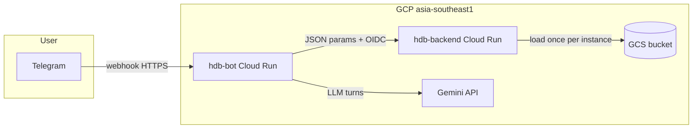

# HDB Resale Price Bot

Telegram conversational bot (“Uncle HDB”) that collects flat details, calls a **CatBoost–ARIMA v4** model on Google Cloud Run, and replies in Singlish using **Google Gemini**. The production architecture is described in [HDB_Resale_Price_Bot_Technical_Guidelines_v3.md](HDB_Resale_Price_Bot_Technical_Guidelines_v3.md); this README focuses on **training v4**, inference, and deployment.

---

## Overall architecture



| Component | Role |
|-----------|------|
| **hdb-bot** | FastAPI webhook + `python-telegram-bot`; in-memory session cache; Gemini for extraction and UX copy; POST to backend `/predict`. |
| **hdb-backend** | FastAPI inference: block lookup → feature engineering → optional ARIMA features from bundle → CatBoost Pool → `expm1` price in SGD. |
| **GCS** (`GCS_BUCKET`, default `hdb-resale-artifacts`) | `models/model_v4.cbm`, `models/metrics_v4.json`, `models/arima_bundle_v4.pkl`, `models/spatial_inference.pkl`, `models/block_lookup.parquet`, `hdb_rpi.csv` (blob paths configurable via env). |
| **Gemini** | Structured JSON per turn (reply + `extracted_params` + flags); optional second call to phrase prediction in Singlish (with fallback). |

---

## Training on HDB resale data (v4)

### Data sources

| File | Purpose |
|------|---------|
| [`data/hdb_resale_complete.csv`](data/hdb_resale_complete.csv) | Master resale transactions + enriched columns used by [`training/v4/train_v4.py`](training/v4/train_v4.py). |
| [`data/hdb_rpi.csv`](data/hdb_rpi.csv) | Official HDB resale price index by quarter; joined in training via `add_official_rpi` ([`backend/app/inference_features.py`](backend/app/inference_features.py)), same pattern as inference. |

### Algorithms and why they are used

1. **CatBoost regressor**  
   - **Target:** `log_resale_price` (natural log of resale price); inference applies `np.expm1` for dollar output ([`backend/app/main.py`](backend/app/main.py)).  
   - **Why CatBoost:** Strong tabular performance with mixed numeric/categorical inputs; handles high-cardinality categoricals (`town`, station/school names) without manual one-hot explosion.

2. **ARIMA bundle** ([`training/v4/arima_v4.py`](training/v4/arima_v4.py))  
   - **Global:** one ARIMA on overall monthly mean **log-price** (all segments).  
   - **Segment:** optional ARIMA per `(town, flat_type)` when the segment has enough months (`MIN_SERIES_LEN = 18`); sparse segments fall back to the global model.  
   - **RPI:** quarterly HDB RPI series is also fitted inside the bundle for inference-time helpers (e.g. stale official series); it is **not** exposed as a separate CatBoost training column in the current v4 artifact.  
   - **Why:** Tree models do not naturally encode smooth autocorrelation / macro drift in time. ARIMA-derived signals summarize **market dynamics** as extra numeric inputs.

**ARIMA features actually fed to CatBoost (two columns)**

From [`ARIMA_FEATURES`](training/v4/arima_v4.py) and [`metrics_v4.json`](training/v4/artifacts/metrics_v4.json) → `arima_features`:

| Feature | Meaning |
|---------|---------|
| `arima_seg_vs_global` | Segment forecast level minus global forecast level at the same calendar period — **relative** positioning (reduces reliance on absolute level mismatch between train vs forecast horizons). |
| `arima_seg_series_std` | Historical log-price volatility for that `(town, flat_type)` cell — a **static** risk signal from the training-era series. |

### Train, validation, and test strategy

Configured in [`training/v4/features_v4.py`](training/v4/features_v4.py):

| Split | Years | Rows (latest artifact) |
|-------|--------|-------------------------|
| **CatBoost train** | 2020–2024 | 42,996 |
| **Early stopping / validation** | 2025 | 8,276 |
| **Test** | 2026 | 2,389 |

**ARIMA history:** transactions **2017–2024** (`HIST_YEAR_START` … `TRAIN_YEAR_END`) are used to fit the monthly series models **before** scoring val/test periods, so segment/global forecasts are not fit on held-out evaluation years.

**Leakage controls** (see module doc in [`training/v4/train_v4.py`](training/v4/train_v4.py)):

- Spatial KDTree smoothing: **past-only** neighbours for training rows; **full training tree** for val/test ([`backend/app/inference_features.py`](backend/app/inference_features.py) — `compute_spatial_features`).
- CatBoost **early stopping on validation MAE** (2025).

### Feature engineering (high level)

Pipeline is shared with inference via [`backend/app/inference_features.py`](backend/app/inference_features.py) and orchestrated in [`training/v4/train_v4.py`](training/v4/train_v4.py):

- **Row engineering:** lease remaining, storey bands, amenity distances/counts, interactions (`engineer_features`).
- **Official RPI:** quarter lag aligned to transaction (`add_official_rpi`) plus macro interaction terms (`add_macro_interaction_features`) — see feature names through `hdb_rpi`, `rpi_x_*` in metrics.
- **Spatial:** KDTree-based smoothed neighbourhood price / PSM signals at **500 m** and **2000 m** (`spatial_*_te`, `spatial_*_psm`).
- **ARIMA columns:** appended after spatial/RPI steps in training; at inference the backend merges the same columns when `metrics["arima_features"]` is present ([`backend/app/preprocessing.py`](backend/app/preprocessing.py)).

**Schema snapshot (v4 artifact):** **51** columns for `Pool`; **6** categorical CatBoost columns (`flat_type`, `flat_model`, `town`, `mrt_name`, `pri_sch_name`, `sec_sch_name`). `Tranc_Year` is numeric. Full ordered list is in [`training/v4/artifacts/metrics_v4.json`](training/v4/artifacts/metrics_v4.json) → `features` / `cat_features`.

### RPI in training vs ARIMA-RPI

- **Training rows:** use **published** quarterly RPI joined to each transaction (`hdb_rpi` and interactions).  
- **Bundle:** fits an ARIMA on the **quarterly RPI series** for operational extensions (future quarters); see [`training/v4/arima_v4.py`](training/v4/arima_v4.py). It does **not** add `arima_rpi_forecast` as a CatBoost input in the shipped v4 metrics.

### Hyperparameters

CatBoost hyperparameters are copied into metrics after training. **Snapshot from** [`training/v4/artifacts/metrics_v4.json`](training/v4/artifacts/metrics_v4.json) (`trained_at` applies to that run only — rerun training refreshes numbers):

| Setting | Value |
|---------|--------|
| Loss | MAE |
| Max iterations | 3000 |
| Early stopping rounds | 100 |
| **Best iteration** | 2176 |
| Depth | 4 |
| Learning rate | 0.208241 |
| L2 leaf reg | 1.66016 |
| Random strength | 0.873233 |
| Bagging temperature | 0.213883 |
| Border count | 204 |
| Min data in leaf | 5 |
| Random seed | 42 |

Source constants in [`training/v4/train_v4.py`](training/v4/train_v4.py); search space / tuning via [`training/v4/hpo_v4.py`](training/v4/hpo_v4.py) (Optuna).

**ARIMA search:** short lists of candidate orders per series type in [`training/v4/arima_v4.py`](training/v4/arima_v4.py); best order picked by **AIC**.

### Evaluation metrics (latest committed artifact)

Numbers below come from [`training/v4/artifacts/metrics_v4.json`](training/v4/artifacts/metrics_v4.json). Regenerate artifacts locally if you need fresher splits.

| Split | MAE (SGD) | RMSE (SGD) | MAPE (%) | R² | log RMSE |
|-------|-----------|------------|----------|-----|----------|
| Train (2020–2024) | 16,464 | 24,111 | 3.13 | 0.981 | 0.0442 |
| Validation (2025) | 26,236 | 38,668 | 3.89 | 0.962 | 0.0526 |
| Test (2026) | 29,584 | 44,985 | 4.42 | 0.953 | 0.0609 |

ARIMA bundle metadata (same file): **126** segment models with dedicated fits (`n_segment_models`), `min_series_len` 18.

### Running training locally

1. **Environment** (recommended — aligns pins with backend + bot):

   ```bash
   conda env create -f environment.yml   # name: hdb-ml-env
   conda activate hdb-ml-env
   ```

   Or install manually from [`training/requirements.txt`](training/requirements.txt), [`backend/requirements.txt`](backend/requirements.txt), [`bot/requirements.txt`](bot/requirements.txt).

2. **Optional tracking:** start MLflow UI at `http://127.0.0.1:5005/` if you use the URI embedded in [`training/v4/train_v4.py`](training/v4/train_v4.py).

3. **Train:**

   ```bash
   cd training/v4 && python train_v4.py
   ```

   Outputs under **`training/v4/artifacts/`**: `model_v4.cbm`, `arima_bundle_v4.pkl`, `metrics_v4.json`, `spatial_inference.pkl`, `feature_importance_v4.csv`.

4. **Upload to GCS:** set `GCS_BUCKET` (default `hdb-resale-artifacts`); successful runs upload `model_v4.cbm`, `arima_bundle_v4.pkl`, `metrics_v4.json`, `spatial_inference.pkl` to `models/` prefix ([`training/v4/train_v4.py`](training/v4/train_v4.py)).

5. **Block lookup parquet** for fuzzy street resolution is maintained separately (see [`scripts/build_block_inference_lookup.py`](scripts/build_block_inference_lookup.py)); backend expects `models/block_lookup.parquet` unless overridden.

---

## Telegram bot and backend

### Bot architecture

- **Entry:** FastAPI app in [`bot/main.py`](bot/main.py); `POST /webhook` forwards Telegram updates to `python-telegram-bot`.
- **Lifecycle:** bot application initializes asynchronously after HTTP bind (Cloud Run startup-friendly).

### Backend architecture

- **Endpoints:** `/predict`, `/health`, `/meta` ([`backend/app/main.py`](backend/app/main.py)).
- **Artifacts:** loaded once per instance via [`backend/app/model_loader.py`](backend/app/model_loader.py) (`lru_cache`): CatBoost model, metrics JSON, spatial bundle, optional ARIMA bundle when metrics list `arima_features`, block lookup parquet, RPI CSV.
- **Inference row:** [`backend/app/preprocessing.py`](backend/app/preprocessing.py) builds one-row DataFrame → engineer → RPI → macro interactions → spatial encodings → ARIMA merge → [`prepare_X`](backend/app/inference_features.py) → CatBoost `Pool`.

### How the bot works (conversation → price)

1. **Session state:** [`bot/cache/session.py`](bot/cache/session.py) — TTL + thread-safe cache per `chat_id`; collects **town**, **block**, **storey_range**, **floor_area_sqm** (required), optional **street_name**.
2. **Gemini turn:** [`bot/llm/engine.py`](bot/llm/engine.py) calls **`gemini-2.5-flash-lite`** with JSON MIME type; [`bot/llm/system_prompt.py`](bot/llm/system_prompt.py) injects collected params and guardrails.
3. **Merge:** `extracted_params` merged with coercion (handles aliases like `floor_area` → `floor_area_sqm`).
4. **Prediction trigger:** when the session has all required params **and** the turn is not `off_topic`, the bot POSTs to **`{BACKEND_URL}/predict`** with a **Google OIDC identity token** when running service-to-service on Cloud Run ([`bot/services/backend_client.py`](bot/services/backend_client.py)). Timeout defaults to **45 s** (`BACKEND_TIMEOUT_SECONDS` override).
5. **Result copy:** Gemini formats the JSON result into Singlish; on failure an automatic **fallback template** is used ([`bot/llm/engine.py`](bot/llm/engine.py)). Markdown replies fall back to plain text on Telegram parse errors ([`bot/main.py`](bot/main.py)).

### Bot setup (local or Cloud Run)

**Environment variables**

| Variable | Purpose |
|----------|---------|
| `TELEGRAM_BOT_TOKEN` | Bot API token (Secret Manager in deploy). |
| `GEMINI_API_KEY` | Generative AI key (Secret Manager). |
| `WEBHOOK_SECRET` | Stored in Secret Manager per deploy workflow; wire your webhook security in your gateway if applicable. |
| `BACKEND_URL` | HTTPS base URL of `hdb-backend` (must match OIDC audience for `call_predict`). |
| `WEBHOOK_URL` | Public URL Telegram should POST updates to (`…/webhook`). |
| `BACKEND_TIMEOUT_SECONDS` | Optional; default `45`. |
| `LOG_LEVEL` | e.g. `INFO`. |
| `SESSION_MAXSIZE`, `SESSION_TTL` | Optional cache tuning ([`bot/main.py`](bot/main.py)). |

**Docker**

- Bot: `docker build -t hdb-bot ./bot` ([`bot/Dockerfile`](bot/Dockerfile)).
- Backend (build from **repo root**): `docker build -f backend/Dockerfile -t hdb-backend .` ([`backend/Dockerfile`](backend/Dockerfile)) — includes `training/v4/arima_v4.py` for unpickling the ARIMA bundle.

---

## GitHub Actions deployment

Workflow: [`.github/workflows/deploy.yml`](.github/workflows/deploy.yml)

- **Trigger:** push to **`main`**.
- **Secrets (GitHub):** `GCP_PROJECT_ID`, `GCP_SA_KEY` (JSON), `BACKEND_URL`, `WEBHOOK_URL`.
- **Backend job:** build/push `gcr.io/$PROJECT_ID/hdb-backend:$SHA`, deploy Cloud Run with service account `hdb-backend@$PROJECT_ID.iam.gserviceaccount.com` and env: `GCS_BUCKET`, `MODEL_VERSION=catboost-arima-v4`, `MODEL_BLOB`, `METRICS_BLOB`, `SPATIAL_BLOB`, `ARIMA_BLOB`, `LOG_LEVEL`.
- **Bot job:** build/push `hdb-bot`, deploy with Secret Manager bindings: `TELEGRAM_BOT_TOKEN`, `GEMINI_API_KEY`, `WEBHOOK_SECRET`; env `BACKEND_URL`, `WEBHOOK_URL`, `LOG_LEVEL`.

Grant the deploy service account permissions to push to Container Registry / Artifact Registry and to deploy Cloud Run; grant **hdb-backend** runtime SA read access to the GCS bucket and (if used) invoke permissions for logging.

---

## Repository map (quick)

| Path | Notes |
|------|------|
| [`training/v4/`](training/v4/) | v4 training, `arima_v4.py`, `features_v4.py`, `hpo_v4.py`, `artifacts/` |
| [`backend/app/`](backend/app/) | FastAPI inference, `preprocessing.py`, `model_loader.py`, `inference_features.py` |
| [`bot/`](bot/) | Telegram + Gemini + backend client |
| [`environment.yml`](environment.yml) | Conda **`hdb-ml-env`** definition |
| [`scripts/build_block_inference_lookup.py`](scripts/build_block_inference_lookup.py) | Block/street lookup parquet for backend |
